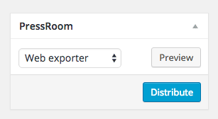
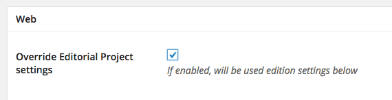
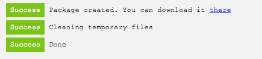

# Exporting an Issue

Exporting Edition is the PressRoom core feature. It works by parsing flatplan content items through the PressRoom template system. 
> For more info about PressRoom themes see [Theming](../theming/README.md)

The PressRoom metabox in the Edit Issue screen allows you to:
- select an export channel
- preview the Issue
- distribute (export/publish) the Issue

##Issue Preview

The __Preview__ button opens up a browser window where you can see the Issue's content wrapped in a responsive preview tool based on Brad Frost's [Ish](http://bradfrost.com/demo/ish/). 

In the Preview toolbar you'll also find a button to show the Issue's TOC and to open each exported file separately to ease the development/debug process.

##Issue Export

PressRoom by default includes the WebExport which allows you to export _Issues_ as a collection fo static html files and assets to the local file system or via ftp/sftp.

> To extend PressRoom with more output channels see [PressRoom Add-ons](../pressroom_addons/README.md)

Web Export settings are configured in your Editorial Project but they can be overwritten on a per Issue basis. 

Performing a Distribute action will open up a new window showing the export progress and operations log. 

If you choose to export to the local filesystem, you'll also find a link to download Issue's content as a zip file, right before the end of the log.  

