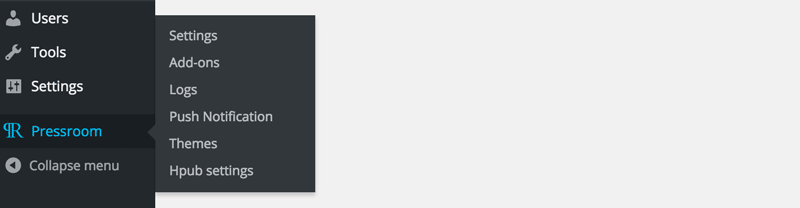
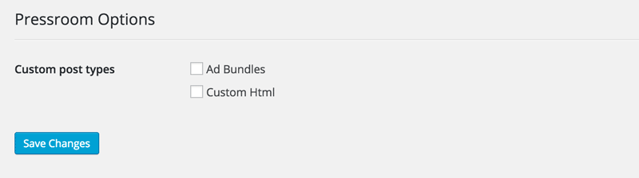
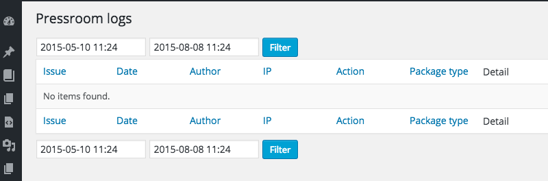
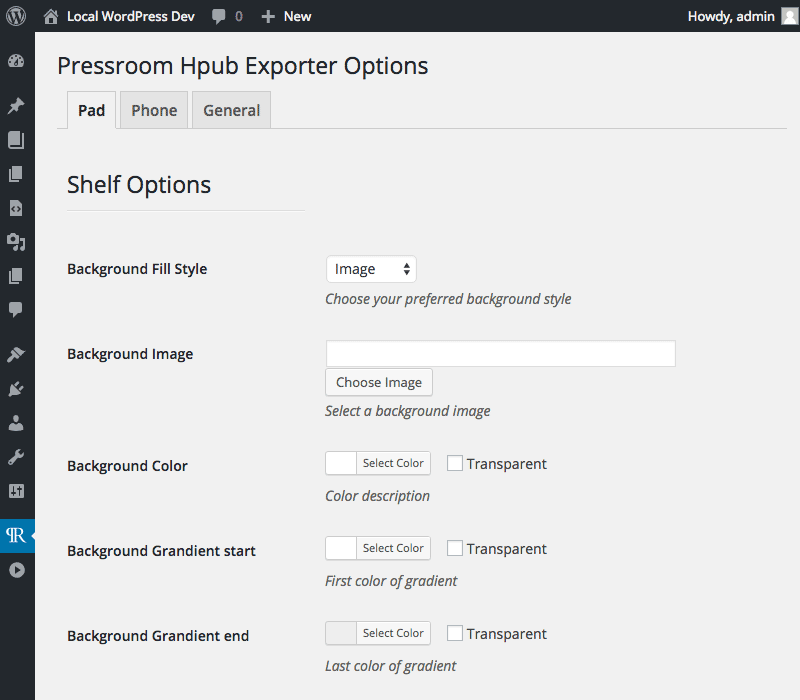
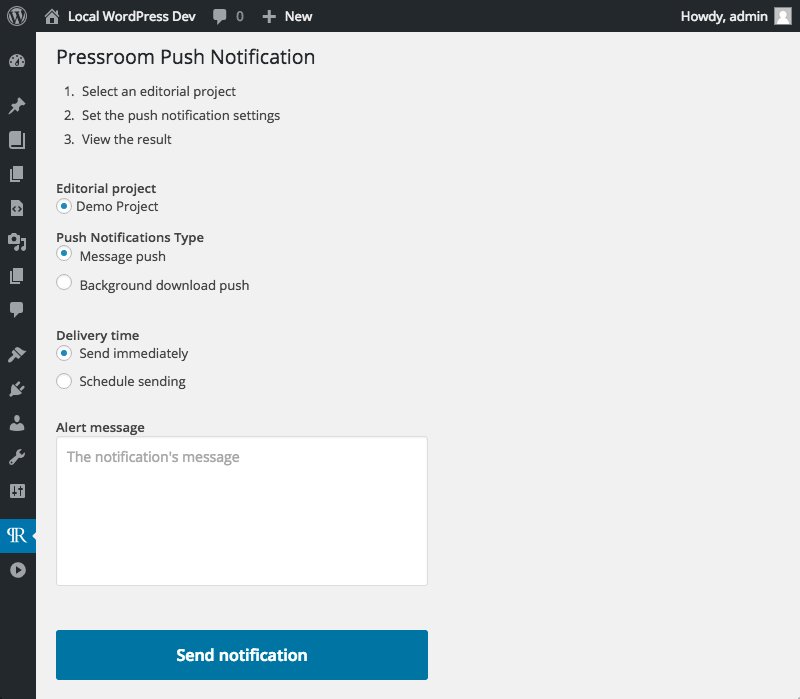

# PressRoom global options

Global PressRoom options can be found under the "PressRoom" item the in administration menu.

##**Settings** 

Allows to specify allowed post types. *Posts* and *Pages* are included by default. PressRoom also comes with two additional Custom Post Types,  *Ad Bundle* and *Custom HTML*. Both allows you to include custom html contents to your "Issues". For more info see <HTNL bundles>

##**Logs** 

A built-in log system to keep track of your pressroom activities. 

##**Themes** 

Here's where you can manage, discover and install themes. More info on themes

##**Add-ons** 

Here's where you could manage, discover and install PressRoom Add-ons. 

##Add-ons specific settings

Some Add-ons may come with global settings pages you'll access under this same administration menu item.

###iOS Exporter
The following settings appears in conjunction with the [iOS Exporter](../pressroom_addons/ios_exporter/README.md)

####**iOS Exporter settings** 

Tabbed group of settings for the iOS Exporter

####**Push Notification** 
   

A Push Notification system, needs the **IOS Exporter** Add-on and a [Parse](https://parse.com/) Api key.
